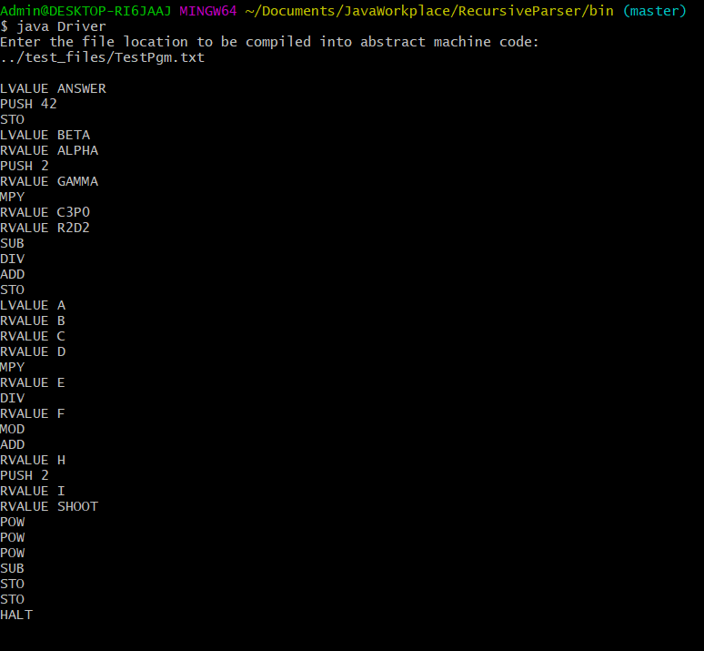

# CSCE434-PA1
Recursive Parser compiler implementation

This program translates a Pascal like syntax into abstract stack machine code. For now, the program can only intepret integers and it is still working only for arithmetic operations.

Usage: Start the program, it will ask you for the location of your code. Once the translation is finished, it will output everything into stdout.

Example usage, this is what is found in file TestPgm.txt: 

```begin
ANSWER := 42;
BETA := ALPHA + 2 * GAMMA div (C3P0 - R2D2);
A := B + C * D div E mod F - H ^ 2 ^ I ^ SHOOT;
end
```

The output is:


